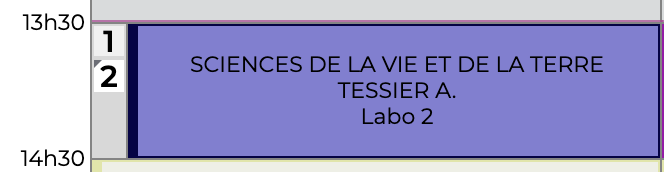

import Image from "next/image";
import img from "./assets/11-09-timetable.png";

## By week

```typescript
import * as pronote from "pawnote";

void async function main () {
  const session = pronote.createSessionHandle();
  await pronote.loginCredentials(session, {
    url: "https://demo.index-education.net/pronote",
    deviceUUID: "some-very-secure-uuid",
    kind: pronote.AccountKind.STUDENT,
    username: "demonstration",
    password: "pronotevs",
  });

  // Let's grab week 3 from the timetable.
  const timetable = await pronote.timetableFromWeek(session, 3);

  const prefix = (lesson: pronote.TimetableClass): string => lesson.startDate.toLocaleString("fr-FR") + " |";
  for (const lesson of timetable.classes) {
    if (lesson.is === "activity") {
      console.log(prefix(lesson), "ACTIVITY:", lesson.title);
    }
    else if (lesson.is === "detention") {
      console.log(prefix(lesson), "DETENTION:", lesson.title);
    }
    else if (lesson.is === "lesson") {
      console.log(prefix(lesson), "LESSON:", lesson.subject?.name || "(unknown subject)");
    }
  }
}();
```

## Parsing

Parsing the timetable is a bit more complex than just fetching it and sorting it by date.
PRONOTE can have superposed classes, canceled classes, planned classes, etc. so if you want to exactly reproduce the PRONOTE timetable, you will have to parse it.

This is **not** the default behavior and you should call a function to do this.
Some people wouldn't want this behavior so it's up to you to decide, it all depends on what you want to do.

```typescript
/// ... create a session and login and get the timetable

pronote.parseTimetable(session, timetable, {
  withSuperposedCanceledClasses: false,
  withCanceledClasses: true,
  withPlannedClasses: true
});

// ... console.log() the lessons
```

If we check the output for the day 11/09/2023, we should see something like this:

```console
11/09/2023 09:00:00 | LESSON: FRANCAIS
11/09/2023 10:00:00 | LESSON: HISTOIRE-GÉOGRAPHIE
11/09/2023 11:00:00 | LESSON: MATHÉMATIQUES
11/09/2023 13:30:00 | LESSON: SCIENCES DE LA VIE ET DE LA TERRE
11/09/2023 13:30:00 | DETENTION: Retenue 13h30 - 14h30
11/09/2023 14:30:00 | LESSON: ANGLAIS LV1
11/09/2023 15:30:00 | LESSON: ÉDUCATION PHYSIQUE ET SPORTIVE
```

Let's compare with the official PRONOTE application:

<Image src={img.src} height={900} width={400} />

As you can see, the `MATHÉMATIQUES` lesson is kept since we enabled the `withCanceledClasses` option.

Note that the lesson behind the `DETENTION` - this one:

is not present in the output because we disabled the `withSuperposedCanceledClasses` option.
